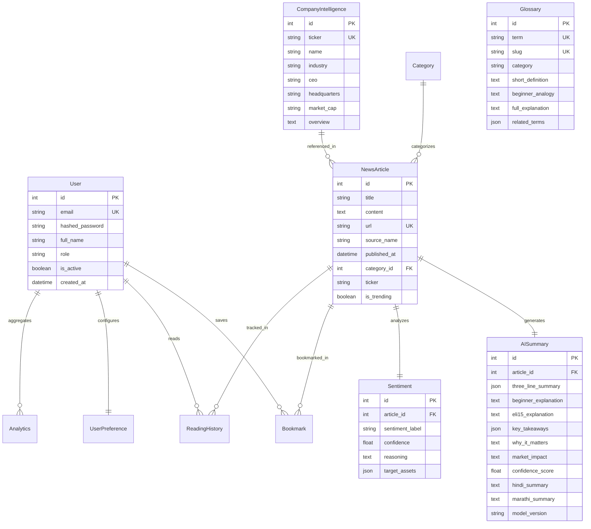
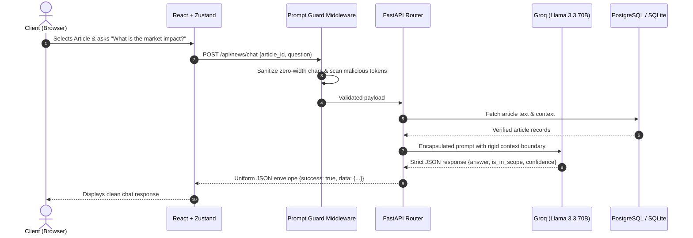

# System Architecture & Technical Design

## Overview

**AI Financial News Simplifier** is an enterprise-grade fintech intelligence platform engineered with a strict clean-architecture separation between presentation, security middleware, application services, and data persistence.

---

## Architectural Principles

1. **Separation of Concerns**: Core business and AI logic is isolated in stateless services (`groq_service.py`, `news_service.py`, `glossary_service.py`).
2. **Defensive Gateway**: All inference requests pass through `PromptGuard` before LLM tokenization to eliminate prompt injection and data exfiltration threats.
3. **Resilient Dual-Engine**: Groq Cloud API with `llama-3.3-70b-versatile` serves as primary inference, backed by an intelligent local semantic fallback engine.
4. **Structured JSON Output**: The LLM outputs strict JSON objects adhering to Pydantic contracts rather than unconstrained markdown.

---

## Entity-Relationship (ER) Diagram

---

## Data Flow Diagram

